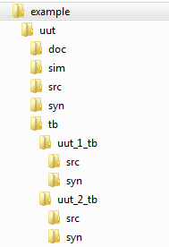

# RTL_make User's Guide

## Table of Contents
 - [Main Features](#toc-main-features)
 - [Application Information](#toc-application-information)
   * [Setup](#toc-setup)
     - [File / Folder Tree Structure](#toc-file-folder-tree-structure)
     - [build.pl Scripts](#toc-build-scripts)
     - [test_prameters.tcl Script](#toc-test_parameters-script)
   * [Usage](#toc-usage)
     - [help](#toc-help)
     - [run](#toc-run)
     - [build](#toc-build)
     - [compile](#toc-compile)
     - [simulate](#toc-simulate)
     - [logunits](#toc-logunits)
     - [loguuts](#toc-loguuts)
     - [logrecursive](#toc-logrecursive)
     - [loglist](#toc-loglist)
     - [testbench](#toc-testbench)
     - [testno](#toc-testno)
     - [runfor](#toc-runfor)
     - [verify](#toc-verify)
     - [report_coverage](#toc-report_coverage)
     - [before_all](#toc-before_all)
     - [after_all](#toc-after_all)
     - [clean](#toc-clean)
     - [clean_private](#toc-clean_private)
 - [Logging](#toc-logging)
   * [rtl_make.log](#toc-rtl_make-log)
   * [before_all_<script_num>.log](#toc-before_all-log)
   * [compilation_<tb_name>.log](#toc-compile-log)
   * [before_sim_<test_no>.log](#toc-before_sim-log)
   * [simulation_<test_no>.log](#toc-sim-log)
   * [after_sim_<test_no>.log](#toc-after_sim-log)
   * [verify_<script_num>.log](#toc-verify-log)
   * [after_all_<script_num>.log](#toc-after_all-log)
 - [FAQ](#toc-faq)
 - [Appendix](#toc-appendix)
   * [A-1 Example Testbench Build Script (build.pl)](#toc-a-1)
   * [A-2 Example Test Parameters (test_parameters.tcl)](#toc-a-2)
   * [A-3 Supported Versions](#toc-a-3)

<a name=toc-main-features></a>
## Main Features
 - Can be used for continual integration and automated regression testing of RTL 
   components.
 - Can be used for batching one or more tests performed by one or more testbenches.
 - Utilizes SEL build_rtl.pl scripting system to build dependencies.
 - Build, compile, simulate, and generate coverage reports with a single command.
 - Generates build, compilation, and simulation logs for post-simulation 
   verification.
 - Enforces uniform user-syntax to abstract away simulator complexities.
 - Runs in both Aldec Acitve-HDL and Mentor Graphics ModelSim simulation 
   environments/TCL interpreters.  Can be used in the GUI console or via 
   command line.

<a name=toc-application-information></a>
## Application Information

RTL_make consists of two TCL scripts; `RTL_make.tcl` and `RTL_sim_lib.tcl`. 
RTL_sim_lib.tcl houses a selection of TCL procedures used to perform clearly 
defined subtasks. RTL_make.tcl utilizes those procedures and wraps them in 
additional logic to provide a simplified command interface.

**Note:** The procedures local to RTL_sim_lib can be used exclusively without 
RTL_make. However, this is not recommended due to risk of non-backwards-compatible 
edits that may be made to the test infrastructure as a whole.

<a name=toc-setup></a>
### Setup

Before use, the user must comply with the following requirements for
structuring the Unit Under Test's (UUT) file / folder tree and is
required to author a set of files whose contents will direct RTL_make
to gather source dependencies for building and will parameterize the
test or suite of tests to be run. Additionally, the user must have Perl
installed. Visit the [SEL 
Perl](https://confluence.metro.ad.selinc.com/pages/viewpage.action?spaceKey=PERL&title=SEL+Perl)
Confluence page for more details.

<a name=toc-file-folder-tree-structure></a>
#### File / Folder Tree Structure

The user is required to implement the file / folder structure as defined
in SEL PROC-0104 with additional requirements defined for the 
`<UUT name>/tb` folder. Those additional requirements are listed below and
shown in Figure 1:

- The `<UUT name>/tb` folder must contain one folder for each
  testbench that is the same name as the testbench entity it contains.
- Each testbench folder must contain a `/src` and a `/syn` directory.
- The source code for each testbench is located in the 
  `<UUT name>/tb/<UUT TB name>/src` directory.
- The simulation build script for each testbench is located in the
  `<UUT name>/tb/<UUT TB name>/syn` directory. Reference
  section build.pl Scripts for more details.

Figure 1 shows an example where the UUT has two testbenches; one named
`uut_1_tb` and another named `uut_2_tb`.

> 
>
> Figure 1: Example File / Folder Structure

<a name=toc-build-scripts></a>
#### build.pl Scripts

The user is required to author at least two Perl scripts that will be
used by build_rtl.pl to locate source dependencies and generate a list
of sources ordered with respect to the hierarchy of the UUT, its
sub-components, and its testbench components. Build scripts must be
named `build.pl`.

The first required build script describes the build for the UUT itself.
This build script should be located in the `<UUT name>/syn`
directory. Refer build_rtl.pl documentation for details regarding the
content of this build script.

Remaining build script describe the build for each testbench. These
build scripts should be located in the `<UUT name>/tb/<UUT TB name>/syn`
directories. An example TB build script is shown in section
[A-1 Example Testbench Build Script (build.pl)](#toc-a-1) of this document.

For each testbench build script, it is required that the `$TEMPFILES`
variable is used to dynamically create a TCL script containing the
hierarchically organized list of sources and source dependencies. This
dynamically generated TCL script must be called `vhd_source_list.tcl`.
For usage requirements of the build.pl scripts and `$TEMPFILES` variable,
see documentation for the build system (build_rtl.pl).

The `vhd_source_list.tcl` file contains a single TCL variable named `$src_list`
that defines a list of source files specified in the right compilation order. 
For example:
```
set src_list \
{
  /components/rtl/endec_linear/src/endec_linear_matrices_pkg.vhd
  /components/rtl/endec_linear/src/endec_linear.vhd
  /components/rtl/ecc/ecc_hamming/src/ecc_hamming.vhd
  /components/rtl/sdpram/tb/sdpram_tb/syn/sdpram_test.vhd
  /components/rtl/sdpram/tb/sdpram_tb/src/sdpram_tb.vhd
}
```

<a name=toc-test_parameters-script></a>
#### test_parameters.tcl Script

The user is also required to author a TCL script called
`test_parameters.tcl` which contains information on how the simulation
setup should be parameterized. This file should be placed in the `<UUT name>/sim`
directory. Its contents are described below:

-   test_parameters.tcl shall include one required TCL dictionary named
    `$test_parameters`. The `$test_parameters` dictionary requires one
    entry per simulation test. Each `$test_parameters` dictionary
    requires a test identifier. The test identifier may be numeric,
    alphabetic, or alphanumeric. Underscores are allowed anywhere in the
    identifier. Each entry shall contain a list of `GENERIC` `VALUE` pairs,
    as shown below (`GENERIC` corresponds to a single generic within the
    testbench that must be assigned and `VALUE` corresponds to the value
    that should be assigned to that generic).
    ```
    dict set test_parameters <TEST ID> \
    {
      <GENERIC> <VALUE>
      . . .
      <GENERIC> <VALUE>
    }
    ```
-   If there are multiple testbenches, test_parameters.tcl must also
    include a required dictionary named `$simulation_map`. If there is
    only one testbench, this dictionary is optional. It shall contain an
    entry named after each test bench folder name (which must match the
    test bench entity name). Each entry contains a list of the test
    identifiers that use that particular entity. That is, the values for
    each key of this dictionary are the entry identifiers of
    `$test_parameters`. For instance:
    ```
    dict set simulation_map <TB1 NAME> {<TEST ID 1> <TEST ID 2>...<TEST ID N>}
    dict set simulation_map <TB2 NAME> {<TEST ID N+1> <TEST ID N+2>}
    ```
-   test_parameters.tcl may also include an optional dictionary named 
    `$compile_options` (when compiling in Active-HDL) or `$compile_options_modelsim`
    (when compiling in ModelSim) which may be used to specify unique compile 
    options for each source file. Refer to your simulator's compile command 
    documentation for a list of available compile options. If you need multiple
    options, they must be added all on same line as shown in the example below. 
    Reference section [A-2 Example Test Parameters](#toc-a-2) for more details.
    ```
    In Active-HDL:
      dict set compile_options <SOURCE_FILE> {<OPTION_1> <OPTION_2>...<OPTION_N>}
    
    In ModelSim:
      dict set compile_options_modelsim <SOURCE_FILE> {<OPTION_1> <OPTION_2>...<OPTION_N>}
    ```
    **Note:** By default all testbench source code is compiled with VHDL 2008 syntax.
    
    **Note:** Adding that line more than once to test_parameters.tcl will overwrite 
    previous lines.
    
    **Note:** The compile_options dictionary can be used to set a different complication
    library using the `-work <lib_name>` option. 
    
    **Note:** Working library inclusion can be achieved using relative path 
    definitions prepended to the working library to be included. 
    
    **Note:** Adding that line more than once to test_parameters.tcl will
    overwrite previous lines. If you need multiple options, they must be
    added all on same line as shown in the example above. 
    
-   test_parameters.tcl may also include an optional dictionary name `$resolution_options`.
    It shall contain a `simulation_resolution` after each test identifier. If a
    `resolution_options` does not specify a particular test case a note will be 
    issued and default simulation resolution (ps) will be used. Format example:
    ```
    dict set resolution_options 1 simulation_resolution
    dict set resolution_options 2 simulation_resolution
    ...
    dict set resolution_options n simulation_resolution
    ```
    Where `simulation_resolution` can be:
    ```
    fs,   1fs,  10fs,   100fs,
    ps,   1ps,  10ps,   100ps,
    ns,   1ns,  10ns,   100ns,
    us,   1us,  10us,   100us,
    ms,   1ms,  10ms,   100ms,
    sec,  1sec, 10sec,  100sec
    ```
    
    Multiple test cases with the same `$resolution_options` can be created with
    the following command:
    ```
    foreach test_no {test cases} {dict set resolution_options $test_no simulation_resolution}
    ```
    For example:
    ```
    foreach test_no {1 2 3 4 5} {dict set resolution_options $test_no fs}
    ```
    **Note:** If there are multiple `$resolution_options` for the same test bench
    the last occurrence will always be used.
    
-   test_parameters.tcl may also include an optional dictionary named
    `$simulate_options` (when compiling in Active-HDL) or
    `$simulate_options_modelsim` (when compiling in ModelSim) which may
    be used to contain additional simulation options of each testbench
    entity.  Reference section [A-2 Example Test Parameters](#toc-a-2) for more details.
    ```  
    In Active-HDL: 
      dict set simulate_options <TB_NAME> {<OPTION_1> <OPTION_2>...<OPTION_N>}
    
    In ModelSim:
      dict set simulate_options_modelsim <TB_NAME> {<OPTION_1> <OPTION_2>...<OPTION_N>}
    ```
    **Note:** Adding that line more than once to test_parameters.tcl will
    overwrite previous lines. If you need multiple options, they must be
    added all on same line as shown in the example above. 

-   test_parameters.tcl may also include an optional dictionary named
    `$wave_lists` whose contents includes a list of signals to log.
    RTL_make uses this dictionary when `loglist` is passed as an option
    to the `simulate` or `run` commands (reference the Usage section of
    this document for more details). The name of the list must be
    specified. For instance:
    ```
    dict set wave_lists <WAVELIST NAME> {
      <SIGNAL ID>
      . . .
      <SIGNAL ID>
    }
    ```

-   test_parameters.tcl may also include an optional dictionary named
    `$before_all_commands`. The contents of this dictionary are keys
    that will be executed on the command-line when RTL_make is run
    without any arguments. Commands execute before any build_rtl call
    is made, and only once per run (i.e. even if you have multiple
    testbenches to build, these only run once). This variable is
    particularly useful for running scripts before any building or
    simulating, such as dispatching other scripts or printing messages.
    Note that any script output in the syn directories of testbenches or
    the component will be deleted when a build is done, so don't output
    important contents to a syn folder.
    ```
    dict set before_all_commands <COMMAND DICT NAME> {<COMMAND>}
    ```
    **Note:** All files/directories placed in `/syn` during the `before_all` 
    execution will be deleted by build_rtl.
    
    **Note:** The `<COMMAND DICT NAME>` name can be any value.

-   test_parameters.tcl may also include optional dictionaries named
    `$before_sim_commands` and `$after_sim_commands`. For each testno
    you define, you can have one corresponding before_sim_commands
    entry, and one after_sim_commands entry. These commands are
    executed before/after the simulate stage for a test case, and are
    convenient for generating stimulus and/or verifying after the test
    what happened. You can have only a before_sim, only after_sim, or
    one of each. Further, not every test is required to have an entry.
    If you call simulate with a specific testno, it will run the
    before/after commands only for that testno (if it exists).
    ```
    dict set before_sim_commands test_1 {python./100_basic_test/gen_data.py}  
    dict set before_sim_commands test_2 {python./101_fancy_test/gen_data.py}  
    
    dict set after_sim_commands test_2 {python./101_fancy_test/verify.py}
    ```
    
-   test_parameters.tcl may also include an optional dictionary named
    `$command_dictionary`. The contents of this dictionary are keys that
    will be executed on the command-line when the RTL_make `verify`
    option is used (reference the Usage section of this document for
    more details). For instance:
    ```
    dict set command_dictionary <COMMAND DICT NAME> {<COMMAND>}
    ```
    This command dictionary is useful for post-simulation verification. The
    user could write a script that parses the simulation log and coverage
    report files to report pass or fail status autonomously. That script can
    be run using the command dictionary. Note that this command runs before
    coverage results are merged.
    
    **Note:** The `<COMMAND DICT NAME>` name can be anything.

-   test_parameters.tcl may also include an optional dictionary named
    `$after_all_commands`. The contents of this dictionary are keys that
    will be executed on the command-line when RTL_make is run with no
    arguments (like before_all_commands). For instance:
    ```
    dict set after_all_commands <COMMAND DICT NAME> {<COMMAND>}
    ```
    This command dictionary is useful for final post-simulation
    verification and continuous integration reporting/scoreboarding. Note
    that this runs after coverage results are merged.
    
    **Note:** The `<COMMAND DICT NAME>` name can be any value.

-   If the default working library name `work` is not appropriate for a
    particular simulation, it may be overridden by setting the global
    *working_library_name* variable in test_parameters.tcl. For
    instance:
    ```
    set working_library_name my_library_name
    ```

<a name=toc-usage></a>
### Usage

RTL_make script should be invoked from the `<UUT name>/sim` folder. In its
simplest use, it should be invoked without arguments as follows:
```
Command line for Active-HDL:
  vsimsa -tcl <PATH TO RTL_make.tcl>/RTL_make.tcl

Command line for Modelsim:
  vsim -c -do "do <PATH TO RTL_make.tcl>/RTL_make.tcl"
  
In Active-HDL or Modelsim GUI Console:
  do <PATH TO RTL_make.tcl>/RTL_make.tcl
```

This call infers the following commands: `before_all`, `build`, `compile`, 
`simulate`, `verify`, `coverage`, and `after_all`.  When a component has multiple 
test benches, each test bench in turn is built, compiled, and the simulations 
associated with it are run. Finally, once all tests have been run, verification 
is run and test coverage is reported.

Alternatively, users can choose actions to run by appending additional
commands to the command sequence specified above.  When any of the inferred commands
listed above are added as command line arguements only those commands specified
will be executed.  For example, to compile and run simulation x:
```
In Active-HDL:
  vsimsa -tcl <PATH TO RTL_make.tcl>/RTL_make.tcl compile simulate testno x

In Modelsim:
  vsim -c -do "do <PATH TO RTL_make.tcl>/RTL_make.tcl compile simulate testno x"
```

Only the commands that are listed in the inferred list above affect which stages
are executed unless specifically documented in that command description.  This 
means the following command:
   
```
In Active-HDL:
  vsimsa -tcl RTL_make.tcl logrecursive

In Modelsim:
  vsim -c -do "do RTL_make.tcl logrecursive"
```
is functionally equivalent to
```
In Active-HDL:
  vsimsa -tcl RTL_make.tcl before_all build <TB_Name> compile simulate logrecursive verify report_coverage after all

In Modelsim:
  vsim -c -do "do RTL_make.tcl before_all build <TB_Name> compile simulate logrecursive verify report_coverage after_all"
```

Or 
```
In Active-HDL:
  vsimsa -tcl RTL_make.tcl testno 1

In Modelsim:
  vsim -c -do "do RTL_make.tcl testno 1"
```
is functionally equivalent to
```
In Active-HDL:
  vsimsa -tcl RTL_make.tcl before_all build <TB_Name> compile simulate testno 1 verify report_coverage after_all

In Modelsim:
  vsim -c -do "do RTL_make.tcl before_all build <TB_Name> compile simulate testno 1 verify report_coverage after_all"
```
etc.


The command line options are described in detail below.

<a name=toc-help></a>
#### help

Use command `help` to print usage help to the console window.
```
In Active-HDL:
  vsimsa -tcl <PATH TO RTL_make.tcl>/RTL_make.tcl help

In Modelsim:
  vsim -c -do "do <PATH TO RTL_make.tcl>/RTL_make.tcl help"
```

<a name=toc-run></a>
#### run \<tb_name\>

Use command `run <tb_name>` to specify a single testbench for which to run.  The
following commands are inferred as part of run: `build`, `compile`, `simulate`, 
and `report_coverage`. This command requires an additional parameter that matches 
the name of the testbench to run.
```
In Active-HDL:
  vsimsa -tcl <PATH TO RTL_make.tcl>/RTL_make.tcl run <TB_NAME>

In Modelsim:
  vsim -c -do "do <PATH TO RTL_make.tcl>/RTL_make.tcl run <TB_NAME>"
```

<a name=toc-build></a>
#### build \<tb_name\>

Use command `build` to specify a single testbench for which to build the
source hierarchy for and generate the vhd_source_list.tcl script. This
command requires an additional parameter that matches the name of the
testbench to build.
```
In Active-HDL:
  vsimsa -tcl <PATH TO RTL_make.tcl>/RTL_make.tcl build <TB NAME>

In Modelsim:
  vsim -c -do "do <PATH TO RTL_make.tcl>/RTL_make.tcl build <TB NAME>"
```

**Note:** This command does not compile the build.

<a name=toc-compile></a>
#### compile

Use command `compile` to compile the current source hierarchy build. A
`build` command must have been run at some point prior to `compile`. Command
`compile` may also be accompanied by the desired compile method – `full`
or `incr`.  If no compile method is specified `incr` is the default.

-  `full`

   Deletes the working library and does a re-compilation of all source
   files.
   ```
   In Active-HDL:
     vsimsa -tcl <PATH TO RTL_make.tcl>/RTL_make.tcl compile full
   
   In Modelsim:
     vsim -c -do "do <PATH TO RTL_make.tcl>/RTL_make.tcl compile full"
   ```
   
   **Note:** `full` compilation only deletes the compiled working library.
   This is not the same as command `clean`

-  incr

   Does not delete the working library. Uses the simulator's incremental
   compilation option, if available. This is the default behavior if
   neither `full` nor `incr` are specified.
   ```
   In Active-HDL:
     vsimsa -tcl <PATH TO RTL_make.tcl>/RTL_make.tcl compile incr
   
   In Modelsim:
     vsim -c -do "do <PATH TO RTL_make.tcl>/RTL_make.tcl compile incr"
   ```

<a name=toc-simulate></a>
#### simulate

Use command `simulate` to initiate a simulation of the current compiled
source hierarchy build. A `build` and a `compile` command must be run at some point
prior to `simulate` which does not call `build` or `compile` automatically.

```
In Active-HDL:
  vsimsa -tcl RTL_make.tcl simulate

In Modelsim:
  vsim -c -do "do RTL_make.tcl simulate"
```

**Note:** This command will automatically log only the ports of the `UUT` entity
by default.  The `logunits` command can be used to adjust the list of entities and 
the `loguuts`, `logrecursive`, and `loglist` commands can be used to adjust the 
signals that are logged.  See below for more details.

<a name=toc-logunits></a>
#### logunits \<entity_list\>
   
   Defines the list of design hierarchies that will be logged during simulation.  
   By default the list is just `UUT`.  Command `logunits` requires an additional
   parameter that specifies the list of entities to log.
   If the `simulate` command is not specified or inferred this command has no effect.
   
   For example, if component `UUT` instantiates subcomponents `foo` and `bar`, 
   the following command will log signals within the UUT and both of its subcomponents.
   ```
   In Active-HDL:
     vsimsa -tcl <PATH TO RTL_make.tcl>/RTL_make.tcl logunits { UUT UUT/foo UUT/bar }
   
   In Modelsim:
     vsim -c -do "do <PATH TO RTL_make.tcl>/RTL_make.tcl logunits \{ UUT UUT/foo UUT/bar \}"
   ```
   **Note:** The spaces surrounding the curly braces are required.

   **Note:** Powershell users must use special escape characters for curly braces.
   The following example is a powershell example to log the testbench signals.
   ```
   In Active-HDL:
     vsimsa -tcl <PATH TO RTL_make.tcl>/RTL_make.tcl logunits `{ UUT UUT/foo UUT/bar `}
   
   In Modelsim:
     vsim -c -do "do <PATH TO RTL_make.tcl>/RTL_make.tcl logunits `{ UUT UUT/foo UUT/bar `}"
   ```

   To log all signals in your design including testbench signals you would use:
   ```
   In Active-HDL:
     vsimsa -tcl <INSERT PATH TO RTL_make.tcl>/RTL_make.tcl logunits { . } logrecursive
   
   In Modelsim:
     vsim -c -do "do <PATH TO RTL_make.tcl>/RTL_make.tcl logunits \{ . \} logrecursive"
   ```
   
<a name=toc-loguuts></a>
#### loguuts
   
   Directs the simulator to log all UUT signals and variables instead of just ports.
   If the `simulate` command is not specified or inferred this command has no effect.
   ```
   In Active-HDL:
     vsimsa -tcl <INSERT PATH TO RTL_make.tcl>/RTL_make.tcl loguuts
   
   In Modelsim:
     vsim -c -do "do <PATH TO RTL_make.tcl>/RTL_make.tcl loguuts"
   ```
   
   **Note:** RTL_make assumes the UUT is labeled `uut` in the HDL hierarchy. The 
   label is not case-sensitive.  Use `logunits` if you need to change the entity
   name.
   
   **Note:** `loguuts` is mutually exclusive with `logrecursive` and `logrecursive`
   will take precedence as it logs more information.

<a name=toc-logrecursive></a>   
#### logrecursive
   
   Directs the simulator to recurse over the hierarchy, starting from the
   UUT, to log all signals and variables.  If more than one entity is specified
   with `logunits` then this command will recursively log for each unity specified.
   If the `simulate` command is not specified or inferred this command has no effect.
   ```
   In Active-HDL:
     vsimsa -tcl <INSERT PATH TO RTL_make.tcl>/RTL_make.tcl logrecursive
   
   In Modelsim:
     vsim -c -do "do <PATH TO RTL_make.tcl>/RTL_make.tcl logrecursive"
   ```
   
   **Note:** `loguuts` is mutually exclusive with `logrecursive` and `logrecursive`
   will take precedence as it logs more information. 

<a name=toc-logunits></a> 
#### loglist \<wavelist_name\>
   
   Directs the simulator to log the list of signals provided by the
   `$wave_lists` dictionary. Command `loglist` requires an additional
   parameter that must match the name of the `$wave_lists` key provided. If
   the `$wave_lists` dictionary does not exist, command `loglist` will not
   be executed and a warning will be printed to the console window.
   If the `simulate` command is not specified or inferred this command has no effect.
   ```
   In Active-HDL:
     vsimsa -tcl <INSERT PATH TO RTL_make.tcl>/RTL_make.tcl loglist <WAVELIST_NAME>
   
   In Modelsim:
     vsim -c -do "do <PATH TO RTL_make.tcl>/RTL_make.tcl loglist <WAVELIST_NAME>"
   ```

<a name=toc-testbench></a>    
#### testbench \<tb_name\>
   
   Specifies which testbench to use for build and simulation. Command `testbench`
   must also include an additional parameter that must match the name of
   the testbench.
   If the `simulate` or `build` command is not specified or inferred this command 
   has no effect.
   ```
   In Active-HDL:
     vsimsa -tcl <INSERT PATH TO RTL_make.tcl>/RTL_make.tcl testbench <TB_NAME>
   
   In Modelsim:
     vsim -c -do "do <PATH TO RTL_make.tcl>/RTL_make.tcl testbench <TB_NAME>"
   ```

<a name=toc-testno></a>   
#### testno \<test_id\>
   
   Directs the simulator to run only the test identified. Command `testno`
   requires an additional parameter that matches one of the
   `$test_parameters` dictionary keys. If multiple testbenches are present
   and the `testbench <option>` is missing, RTL_make will attempt to
   automatically resolve the `testno` requested to a specific testbench.
   ```
   In Active-HDL:
     vsimsa -tcl <INSERT PATH TO RTL_make.tcl>/RTL_make.tcl testno <TEST_ID>
   
   In Modelsim:
     vsim -c -do "do <PATH TO RTL_make.tcl>/RTL_make.tcl testno <TEST_ID>"
   ```

<a name=toc-runfor></a>   
#### runfor \<args\>
   
   Determines a time limit for either a single simulation (if specified) or
   all simulations to be executed. Accepts up to two inputs as arguments
   and requires at least one. It is the user's responsibility to ensure
   that the argument[s] following `runfor` is appropriately syntaxed for
   the `run` command according to the target simulation tool. (e.g command
   sequence `runfor thehills` is likely not acceptable syntax.)
   ```
   In Active-HDL:
     vsimsa -tcl <INSERT PATH TO RTL_make.tcl>/RTL_make.tcl runfor <ARGS>
   
   In Modelsim:
     vsim -c -do "do <PATH TO RTL_make.tcl>/RTL_make.tcl runfor <ARGS>"
   ```

<a name=toc-verify></a>
#### verify

Use command verify to optionally invoke the commands specified by the
contents of the `$command_dictionary`. If the `$command_dictionary` does
not exist this command will not execute and a warning will be printed
stating so.
```
In Active-HDL:
  vsimsa -tcl <INSERT PATH TO RTL_make.tcl>/RTL_make.tcl verify

In Modelsim:
  vsim -c -do "do <PATH TO RTL_make.tcl>/RTL_make.tcl verify"
```

<a name=toc-report_coverage></a>
#### report_coverage

Use command `report_coverage` to direct the simulator to generate a
coverage report following simulation.
```
In Active-HDL:
  vsimsa -tcl <INSERT PATH TO RTL_make.tcl>/RTL_make.tcl report_coverage

In Modelsim:
  vsim -c -do "do <PATH TO RTL_make.tcl>/RTL_make.tcl report_coverage"
```

<a name=toc-before_all></a>
#### before_all

Use command `before_all` to execute the commands defined in the `$before_all_commands`
dictionary as the first step of RTL_make.  Refer to 
[test_prameters.tcl Script](#toc-test_parameters-script) for more information.
```
In Active-HDL:
  vsimsa -tcl <INSERT PATH TO RTL_make.tcl>/RTL_make.tcl before_all

In Modelsim:
  vsim -c -do "do <PATH TO RTL_make.tcl>/RTL_make.tcl before_all"
```

<a name=toc-after_all></a>
#### after_all

Use command `after_all` to execute the commands defined in the `$after_all_commands`
dictionary as the final step of RTL_make.  Refer to 
[test_prameters.tcl Script](#toc-test_parameters-script) for more information.
```
In Active-HDL:
  vsimsa -tcl <INSERT PATH TO RTL_make.tcl>/RTL_make.tcl after_all

In Modelsim:
  vsim -c -do "do <PATH TO RTL_make.tcl>/RTL_make.tcl after_all"
```

<a name=toc-clean></a>
#### clean

RTL_make keeps track of files created during each execution of
RTL_make. Use command `clean` to delete these previously-created files.
Any file created in the component directory or sub-directories while
RTL_make is running will be included in the list of files to delete,
regardless of whether RTL_make created the file or not. Therefore, do
not create work products in the component directory while RTL_make is
executing and then run clean. These work products WILL BE DELETED!
```
In Active-HDL:
  vsimsa -tcl <INSERT PATH TO RTL_make.tcl>/RTL_make.tcl clean

In Modelsim:
  vsim -c -do "do <PATH TO RTL_make.tcl>/RTL_make.tcl clean"
```

**Note:** RTL_make is unable to keep track of files created during an
interrupted execution of RTL_make (e.g. Ctrl+C). Any files created
during an interrupted execution will not be deleted with clean.

<a name=toc-clean_private></a>
#### clean_private

When working in IBM ClearCase, use command `clean_private` to delete
view-private files as defined by ClearCase in the `<UUT name>/sim` and 
`<UUT name/tb` folders.
```
In Active-HDL:
  vsimsa -tcl <INSERT PATH TO RTL_make.tcl>/RTL_make.tcl clean_private

In Modelsim:
  vsim -c -do "do <PATH TO RTL_make.tcl>/RTL_make.tcl clean_private"
```

**Note:** This command is only supported with development in ClearCase.
This command will not be executed if RTL_make detects that it is not
being used within a ClearCase-mapped drive.

<a name=toc-logging></a>
## Logging

RTL_make generates several different log files for use by downstream
processes and/or to aid in troubleshooting. A brief description of those
log files is provided below:

<a name=toc-rtl_make-log></a>
### rtl_make.log

This is a TOML formatted log file that contains basic flow information
about the RTL_make execution. This includes information about the
simulator version and the status of each step that is performed by
RTL_make.

<a name=toc-before_all-log></a>
### before_all_<script_num>.log

This is a capture of STD_OUT of the execution of each before_all
script as specified in the before_all_commands dictionary.

<a name=toc-compile-log></a>
### compilation_<tb_name>.log

This is a capture of STD_OUT of the compilation process for each
testbench.

<a name=toc-before_sim-log></a>
### before_sim_<test_no>.log

This is a capture of STD_OUT of the before_sim commands as specified
in the before_sim_commands dictionary.

<a name=toc-sim-log></a>
### simulation_<test_no>.log

This is a capture of STD_OUT of the simulation process for each test
number.

<a name=toc-after_sim-log></a>
### after_sim_<test_no>.log

This is a capture of STD_OUT of the after_sim commands as specified in
the after_sim_commands dictionary.

<a name=toc-verify-log></a>
### verify_<script_num>.log

This is a capture of STD_OUT of the execution of each verification
script as specified in the command_dictionary dictionary.

<a name=toc-after_all-log></a>
### after_all_<script_num>.log

This is a capture of STD_OUT of the execution of each after_all script
as specified in the after_all_commands dictionary.

<a name=toc-faq></a>
## FAQ

**Q:** Can multiple commands be used in the same execution of
RTL_make?

**A:** Yes. Many combinations are supported. For example, to run all
steps for test bench `whitebox_tb` logging the signals from the
`$wave_lists` dictionary entry named whitebox_list:
```
In Active-HDL:
  vsimsa -tcl <INSERT PATH TO RTL_make.tcl>/RTL_make.tcl run whitebox_tb loglist whitebox_list

In Modelsim:
  vsim -c -do "do <PATH TO RTL_make.tcl>/RTL_make.tcl run whitebox_tb loglist whitebox_list"
```

Or, to build the `whitebox_tb` test bench and compile its sources:
```
In Active-HDL:
  vsimsa -tcl <INSERT PATH TO RTL_make.tcl>/RTL_make.tcl build whitebox_tb compile

In Modelsim:
  vsim -c -do "do <PATH TO RTL_make.tcl>/RTL_make.tcl build whitebox_tb compile"
```

Or, to run only simulation n with a set simulation time of 100
milliseconds (assuming there has already been a `build` and a `compile`
command issued):
```
In Active-HDL:
  vsimsa -tcl <INSERT PATH TO RTL_make.tcl>/RTL_make.tcl simulate testno 1 runfor 100 ms

In Modelsim:
  vsim -c -do "do <PATH TO RTL_make.tcl>/RTL_make.tcl simulate testno 1 runfor 100 ms"
```

**Q:** Where does RTL_make leave its deliverables (e.g. simulations
logs, waveforms, coverage reports, etc.)?

**A:** Simulation logs, waveform files, compilation logs, and coverage
reports will be left in the /sim directory. A log of the most recent
build execution can be found in the `<UUT name>/tb/<UUT TB name>/reports` 
directory. The build system may also dynamically generate source dependencies 
which will be stored in the `/syn` directories.

**Q:** Do I have to always include the `-tcl` tag when calling VSimSa?

**A:** When using RTL_make, yes. VSimSa also supports .do script syntax
and, in fact, .do script syntax is the default syntax used when VSimSa
is called. RTL_make is implemented using TCL syntax which, in some
cases, is slightly different from .do syntax. Using the `-tcl` tag
informs VSimSa that the script being run is TCL. Furthermore, without
the `-tcl` tag, command line arguments may get improperly parsed by some
simulators.

**Q:** How do I add variables to my waveforms?

**A:** Active-HDL requires that you specify the path to the variable.
That is, the variable's hierarchy down to the process name. Example:
```
vsimsa –tcl \components\tools\tcl\RTL_make.tcl simulate logrecursive logunits \
{ /my_tb/my_uut/my_uut_process /my_tb/my_tb_process }
```

**Note:** the spaces after the opening { and before the closing }.

<a name=toc-appendix></a>
## Appendix

<a name=toc-a-1></a>
### A-1 Example Testbench Build Script (build.pl)
```
# Copyright (c) 2017 Schweitzer Engineering Laboratories, Inc.
# SEL Confidential
$VARS =
{
  VHD_SOURCE_LIST_TCL_FILE => "$MYDIR../../../sim/vhd_source_list.tcl",
};
$SOURCES =
[
  # This is the UUT's testbench
  "$MYDIR../src/eth_saif_gmii_rx_32_tb.vhd",
];

$COMPONENTS =
[
  # These are components instantiated within the UUT's testbench, not
  # sub-components of the UUT.
  
  "$MYDIR../../../../eth_saif_gmii_rx_32; DEVICE_FAMILY=>simulation",
  "$MYDIR../../../../../crc_generic",
  "$MYDIR../../../../../tb/saif_slave",
  "$MYDIR../../../../../tb/gmii_master",
];

# Dynamically generate vhd_source_list.tcl
$TEMPFILES =
[
  {
    NAME => $VARS->{VHD_SOURCE_LIST_TCL_FILE},
    TEXT =>
      "#-------------------------------------------------------------------------\n" .
      "# Copyright (c) 2017 Schweitzer Engineering Laboratories, Inc.\n" .
      "# SEL Confidential\n"
      "#-------------------------------------------------------------------------\n" .
      "\n" .
      "set src_list \\\n" .
      "{\n" .
      "<<< SOURCES>>>" .
      "}\n"
  },
];
```

<a name=toc-a-2></a>
### A-2 Example Test Parameters (test_parameters.tcl)
```
# Copyright (c) 2017 Schweitzer Engineering Laboratories, Inc.
# SEL Confidential
#-------------------------------------------------------------
# Map 7 TEST IDs to two TB NAMEs.
#-------------------------------------------------------------
dict set simulation_map my_tb_entity {_my_test_01 2 3 4 7}
dict set simulation_map my_other_tb_entity {5 6}

#-------------------------------------------------------------
# Set special compile options for individual sources.
#-------------------------------------------------------------
# Compile my_source1.vhd with VHDL 2008 syntax.
dict set compile_options my_source1.vhd {-2008}

# Compile my_source2.vhd with VHDL 2008 syntax and relax strict
# LRM requirements related to case-statements
dict set compile_options my_source2.vhd {-relax -2008}

# Compile vendor_src.vhd with working library vendor_lib included
# and relax strict LRM requirements related to case-statements.
# working library inclusions can include relative path specification.
dict set compile_options vendor_src.vhd {-relax -work ../../vendor_lib}

# NOTE: All sources associated with the UUT's testbench are
# automatically compiled with VHDL 2008 syntax. The user
# should reference the vendor's compile option definitions
# before use.

#-------------------------------------------------------------
# Set special simulate options for my_tb_entity
#-------------------------------------------------------------
# Simulate with a simulation time iteration limit of 10,000 and
# suppress warnings generated by IEEE libraries.
dict set simulate_options my_tb_entity {-i 10000 -ieee_nowarn}

#-------------------------------------------------------------
# Set preserve simulate option for my_source1.vhd
#-------------------------------------------------------------
# Preserve temporary files created during compilation to avoid
# Error: VLM_0044: my_source1.vhd : Cannot decompress library data for 'unit my_source1'.
# which occurs for some components when simulations are executed from clearcase.
# This option only applies to Aldec Active-HDL therefore the following command
# conditionally includes this option. Aldec Case ID SPT72166.
if {[info exists aldec] && [info exists BatchMode]} {dict set compile_options my_source1.vhd {-preserve}}

#-------------------------------------------------------------
# Define TEST IDs
#-------------------------------------------------------------
# _my_test_01 has six generic values. NOTE: one $test_parameters
# dict is required for each TEST ID (not shown here).

dict set test_parameters _my_test_01 \
{
  GENERIC_BOOLEAN false
  GENERIC_INTEGER 42
  GENERIC_REAL 3.14
  GENERIC_TIME 13ns
  GENERIC_STRING1 "VHDL string with spaces"
  GENERIC_STRING2 vhdl_string_without_spaces
}

#-------------------------------------------------------------
# Define a WAVELIST NAME to log signals using "loglist"
#-------------------------------------------------------------
dict set wave_lists whitebox_list {
  clk
  reset
  uut/blk/*
  # Use double-quotes to add log identifiers with spaces
  "-rec uut/*"
}

#-------------------------------------------------------------
# Define post-verification script for use with "verify"
#-------------------------------------------------------------
# Execute one Python script called verify.py
dict set command_dictionary python_test {python verify.py}
```

<a name=toc-a-3></a>
### A-3 Supported Versions
-   Supported in Aldec Active-HDL versions 10.1, 10.2, and 10.3.
-   Supported in ModelSim 10.6c.
