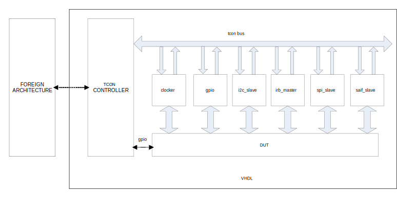

[//]: # (Copyright 2018, Schweitzer Engineering Laboratories, Inc.)
[//]: # (SEL Confidential)
# tb_tcon Testbench Controller
## Introduction
TCON is a testbench controller.  It is used to provide zero simulation
time access and simulation control via non-VHDL languages. The framework
only supports Modelsim.

Known external language wrappers for TB control include:

1. pytcon - Python wrapper for tb_tcon - Install via SEL PyPi mirror.

   Includes all tcon functions, plus popular slave component models.

Note that this document describes tb_tcon, which is built on TCON 2.0,
versus tcon_t0, which uses a different architecture.
Both versions are port-wise and generic-wise equivalent, with the
difference being that tb_tcon does not cap the maximum tcon_req or
tcon_gpio lines to 32 bits (they are unconstrained).

## Block Diagram


## Application Information
The tcon controller utilizes a foreign language interface to bridge the
gap between RTL and a foreign architecture like Python or Ruby.  For VHDL
implementations, it uses the the FLI (for Modelsim).

At simulation startup, the command indicated by **COMMAND_LINE**
is executed. The shared library passes several arguments to the script, see its
documentation for more specific information.

The **INST_NAME** generic provides the ability to uniquely identify the
instance in use.

The build.pl requires setting a SHARED_LIB variable with the name
of the shared library to use when building the component. An appropriate
suffix is added based on the OS launching it (either .dll or .so).
Usage may look like the following:

```
  $COMPONENTS =
  [
    "$MYDIR../../tb_tcon; SHARED_LIB=>scripted-component",
  ];
```

To use this component on Windows, the shared library
must be findable in your machines's PATH.

To use this component on Linux, the shared library must be
findable in LD_LIBRARY_PATH.

### Tcon Concepts
Tcon slaves have a single-bit request.  This acts like a chip select.
The tcon master (this component, tb_tcon) supports a generic number of
slaves via the `tcon_req` signal. Each bit corresponds to a unique
request. For example, `tcon_req[0]` corresponds to request 0,
`tcon_req[3]` corresponds to request 3, etc.

Each slave has its own unique address space.  Individual slave
documentation defines what addresses are available, and how large
of an address bus is required.

All accesses to tcon slaves can be done in zero-time.  Transactions are
done using delta cycles.  However, some slave accesses may cause time
to pass if the transaction cannot be completed in zero time.  For
example, the irb_master_t0 component takes multiple clocks to complete
an IRB transaction, so a transaction will cause time to pass.

_Note: In the below examples and descriptions, a Python foreign binding
is assumed, but the concepts can be applied to any language wrapper._

If a slave cannot complete a transaction, it may assert *tcon_err*
indicating a transaction error.  In this case, a Python exception,
*TransferException* is raised. The exact type of exception will depend
on the wrapper used. For example:
```
    try:
      tcon.read(0, 5) # Read from request 0, address 5
    except tcon.TransferException:
      print 'Read from request 0, address 5 failed!'
```

A single GPIO port is available to monitor or change the RTL
environment. All GPIO pins default to inputs at the start of simulation.

### Tcon Functions
Different language wrappers will support various 'TCON functions', for
example, one wrapper may implement `tcon.sync()` to wait for some number
of clocks.

This component simply serves as the interface to a VHDL TCON bus -
refer to your wrapper of choice's documentation for what functions are
implemented, and how to use them.


## Generics
**Name**    |**Range**| **Description**
:-----------|:-------:|:--------------
INST_NAME   | string  | Name of the instance.
COMMAND_LINE| string  | Filename of the Python script to execute

## Signals
**Name**  |**Width**   |**Direction**|**Description**
:---------|:----------:|:------------|:--------------
tcon_req  | <>         | out         | Tcon request
tcon_ack  | 1          | out         | Tcon acknowledge
tcon_err  | 1          | out         | Tcon error
tcon_addr | <>         | out         | Tcon address
tcon_data | <>         | inout       | Tcon data
tcon_rwn  | 1          | out         | Tcon read/not write
tcon_gpio | <>         | inout       | General purpose I/O
clk       | 1          | in          | Synchronization clock

## Internal Registers
N/A  There are no internal registers
