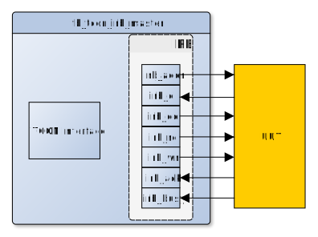

<!---
  Copyright (c) 2018 Schweitzer Engineering Laboratories, Inc.
  SEL Confidential
-->
# Name
IRB Master Testbench Controller

# Main Features
* Testbench component used for testing a component that has an IRB Slave Interface
* IRB RSI Compliant (byte enables are not supported)
* TCON Compliant
  - TCON 1.0
  - TCON 2.0

# Block Diagram


## Application Information
The IRB Master TCON test component issues read/writes to the connected IRB interface. 
Upon issuing a TCON transaction, the IRB Master directly translates the issued 
TCON transaction to an equivalent IRB transaction. Essentially, the valid 
address space for this TCON test component is the attached IRB interfaces 
valid address space. The examples below are assuming python bindings and
the actual usage may vary:

### Read Transaction Example
```
   read_data = tcon.read(REQ_IRB, 0x0F)
```
The above code is used to access IRB address **0x0F**. 


### Write Transaction Example
```
   tcon.write(REQ_IRB, 0x01, 0xFF)
```
The above code is used to write **0xFF** at IRB address **0x01**.

### IRB Data Read Check
According to the standard, IRB reads must maintain their value between 
an acknowledgement and the next read pulse. By default, this component
will flag the above scenario as a warning. Refer to the RD_ERR_FATAL
generic on how to change the warning to an error.


# Interface
Generic           | Type    | Range        | Description
:-----------------|---------|--------------|---------------
A_WIDTH           | integer | 1 to 31      | IRB Address Width; unused, but left for backwards compatibility
TIMEOUT           | positive| unconstrained| Timeout Duration defined in clock cycles (default to 1)
FLOP_DELAY        | time    | unconstrained| Delay before assigning signals (default to 1ps)
RD_ERR_FATAL      | boolean | true/false   | IRB Data Input Error Fatal Indicator (default to false/warning)

## Ports
Port       | Direction | Width    | Description
:----------|-----------|----------|--------------
tcon_req   | in        |   1      | TCON Request Signal 
tcon_ack   | out       |   1      | TCON Acknowledgement Signal
tcon_err   | out       |   1      | TCON Error Signal
tcon_addr  | in        |  32      | TCON Address Signal
tcon_data  | inout     |   *      | TCON Bi-directional Data Bus
tcon_rwn   | in        |   1      | TCON Read Write Signal
reset      | in        |   1      | System reset
irb_clk    | in        |   1      | System clock
irb_addr   | out       |   *      | IRB Address
irb_di     | in        |   *      | IRB Data In
irb_do     | out       |   *      | IRB Data Out
irb_rd     | out       |   1      | IRB Read 
irb_wr     | out       |   1      | IRB Write
irb_ack    | in        |   1      | IRB Acknowledge
irb_busy   | in        |   1      | IRB Busy

*: irb_di/irb_do/irb_addr are unconstrained, so width is determined by the width
of what is connected. If the tcon_data/addr bus is larger than what is connected
with, the unused bits will be zero-padded. If smaller, the value passed will be 
silently truncated.  There is no requirement for matching irb_di & irb_do.

# Timing Specifications and Diagrams
IRB RSI Compliant (byte enables are not supported)

# Internal Registers
N/A
