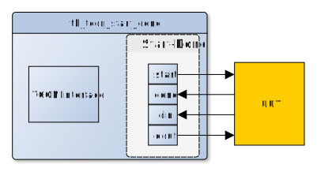

<!---
  Copyright (c) 2018 Schweitzer Engineering Laboratories, Inc.
  SEL Confidential
-->
# Name
Start Done Testbench Controller

# Main Features
* Testbench component used for testing a component that has a Start-Done Slave 
  Interface 
* Start-Done RSI Compliant
* TCON Compliant
  - TCON 1.0
  - TCON 2.0

# Block Diagram

# Application Information
The start_done_master_t0 is intended as a testbench module to test any 
Start-Done slave interface. This test component outputs the data word from 
the command file along with the 'start' pulse, and then logs the output data 
from the unit under test associated with the 'done' pulse.

The input and output 'data' buses can be sized arbitrarily as necessary. 
External processing is needed to convert from any other format.

# INTERFACE
## Generics

Generic           | Type    | Description  |
:-----------------|---------|--------------|
DIN_WIDTH         | integer | Width of the input data. This is the size, in   bits, of the data field in the input file. |
DIN_FLAG_WIDTH    | integer | Number of flags on the input data. This is the   number of bits of additional flags present in the   input file. |
DOUT_WIDTH        | integer | Width of the output data. This is the size, in   bits, of the data field in the output file. |
DOUT_FLAG_WIDTH   | integer | Number of flags on the output data. This is the   number of bits of additional flags present in the   output file. |
COMMAND_FILE      | string  | Name of the command file. Must be present. |
LOG_FILE          | string  | Logging filename. When configured as a master,   'din' is logged when 'done' is asserted. When   cofigured as a slave,'din' is logged when 'start'   is asserted. |
FLOP_DELAY        | time    | Delay before assigning signals

## Ports
Port       | Direction | Width                      | Description
:----------|-----------|----------------------------|--------------
tcon_req   | in        |   1                        | TCON Request Signal 
tcon_ack   | out       |   1                        | TCON Acknowledgement   Signal
tcon_err   | out       |   1                        | TCON Error Signal
tcon_addr  | in        |  32                        | TCON Address Signal
tcon_data  | inout     |  32                        | TCON Bi-directional Data   Bus
tcon_rwn   | in        |   1                        | TCON Read Write Signal
clk        | in        |   1                        | System clock
reset      | in        |   1                        | System Reset
start      | out       |   1                        | Start pulse output to the   unit under test.   'start' is pulsed along   with the data word   from the command file.
done       | in        |   1                        | 'done' pulse from the   unit under test.
din        | in        | DIN_WIDTH+DIN_FLAG_WIDTH   | Data input from the design   under test associated with  the 'done' pulse. This   data is logged to the log   file. 
dout       | out       | DOUT_WIDTH+DOUT_FLAG_WIDTH | Output data from the   command file to the unit   under test
unpause    | in        |   1                        | Unpauses the test component
is_paused  | out       |   1                        | Provides the pause state   of the component                                                    

*Note* The TCON interface (tcon_x signals) need not be mapped if the TCON
interface is not used.

# Timing Specifications and Diagrams
This component is Start-Done RSI Compliant

# Internal Registers
Address | Description
:-------|---------------
0       | Manual Control
1       | Minimum Burst
2       | Maximum Burst
3       | Minimum Delay
4       | Maximum Delay
5       | Seed
6       | Start Count
7       | Done Count
8       | Timeout
9       | Severity
10      | Compliance

## TCON Interface
The TCON interface exposes 11 registers to control and configure the 
start_done_t0 component.

## Manual Control (Address 0)
Bit 0 is the paused status.  If a 1, the component is 
paused.  If paused, it may be written to a 1 to unpause 
the component.  A write of 0 is ignored.

## Minimum Burst (Address 1)
Sets the minimum burst.  Must be less than or equal to the Maximum Burst
register.  This can be changed while the component is unpaused, but may cause
the component to operate unpredictably.  If Minimum Burst and Maximum Burst
are unequal, the the burst is randomized.

## Maximum Burst (Address 2)
Sets the maximum burst.  Must be greater than or equal to the Minimum Burst
register.  This can be changed while the component is unpaused, but may cause
the component to operate unpredictably.  If Minimum Burst and Maximum Burst
are unequal, the the burst is randomized.

## Minimum Delay (Address 3)
Sets the minimum delay. Must be less than or equal to the Maximum Delay
register. This can be changed while the component is unpaused, but may cause
the component to operate unpredictably. If Minimum Delay and Maximum Delay
are unequal, the the delay is randomized.

## Maximum Delay (Address 4)
Sets the maximum delay. Must be greater than or equal to the Minimum Delay
register. This can be changed while the component is unpaused, but may cause
the component to operate unpredictably. If Minimum Delay and Maximum Delay
are unequal, the the delay is randomized.

## Seed (Address 5)
Sets/gets the random seed. This can be changed while the component is unpaused,
but may cause the component to operate unpredictably.

## Start Count (Address 6)
The number of start pulses generated. Reset the counter by writing any value to 
it. 

## Done Count (Address 7)
The number of done pulses received. Reset the counter by writing any value to 
it.

**Note**: In case of timeout the done counter is not incremented. 

## Timeout (Address 8)
Sets the Timeout value. This can be changed while the component is unpaused, 
but may cause the component to operate unpredictably. 

## Severity (Address 9)

Severity | Description
:--------|------------------
0        | The assertion is of severity 'failure'
1        | The assertion is of severity 'error'
2        | The assertion is of severity 'warning'
3        | The assertion is of severity 'note'
4        | No assertion

Sets the severity value in the event a timeout occured and a dont was not
received. This can be changed while the component is unpaused, 
but may cause the component to operate unpredictably.

## Compliance (Address 10)
Sets the start/done compliance value. At default settings this is set to 0. 
When set to 0, the signal din can not change between a done pulse and the next 
start pulse. When set to a 1, the sim will report a warning if din changes
outside of the start/done cycle. 

# FILE FORMATS AND COMMANDS
All data present in the file will be formatted as decimal data by default.
Providing 0x or 0b will allow for hex and binary respectively.

Example: With DIN_WIDTH = 32, DIN_FLAG_WIDTH = 0, DOUT_WIDTH = 32, 
DOUT_FLAG_WIDTH = 0

    Command file contents           Log File Contents
    01010101                        DEADBEAF
    02020202                        ABABABAB
    0A0A0A0A                        BAADBEEF

Comments are also supported by providing the '#' or ';' character preceding the comment.
Comments may be placed anywhere in the file.

    # This is a comment
    ; This is also a comment
    pause # Pause the Component
    0xdeadbeef ; Send 0xdeadbeef to the component
  
The COMMAND_FILE format is a line by line list of commands. The
command file is processed until the file is exhausted.  Once exhausted, the
component will restart at the beginning of the file.

## pause
Pauses the component.  Can only be unpaused via the TCON interface.

## idle N
Idles the component for N clock cycles. 

During an idle, both 'start' and 'done' are deasserted/hi-Z and ignored until 
the idle completes. 

## burst min [max]
Sets the burst count for transfers.  Must be greater than 0.  If only
min is given, sets the burst to a fixed value of 'min'.  If min and max
are given, each burst is randomized in the interval [min, max].  The 
internal seed that is set is used for the randomization.

A burst is the number of transfers that occur prior to a delay.  Bursts are
interrupted by another burst command or pausing the component.  
1 burst represents 1 complete Start-Done transaction.
min and max must be decimal values.

Default:  1

## delay min [max]
Sets the delay count between burst transfers.  May be 0.  If only min is given,
sets the delay to a fixed value of 'min'. If min and max are given, each delay
is randomized in the interval [min, max].  The internal seed that is
set is used for the randomization.
Delay represents idle clock cycles between bursts.

min and max must be decimal values.

Default: 0

## timeout N [severity]
Sets the timeout value and the severity value to be applied in case of 
timeouts. If the component doesn't receive a done within N (Timeout clock 
Cycles), it makes an assert based on the value of severity. 

Severity accepts values from 0 to 4 and the result will be as shown below:

Severity | Description
:--------|------------------
0        | The assertion is of severity 'failure'
1        | The assertion is of severity 'error'
2        | The assertion is of severity 'warning'
3        | The assertion is of severity 'note'
4        | No assertion

**Note**: The component logs XXX...XXX in the the LOG_FILE in case of a Timeout.
Timeout is initialized to 1. Thereby this value should be set to a desired 
value always while using the start_done_master_t0. 
Severity defaults to 0.

## seed N
Sets the internal seed value. N is an integer number that represents the seed
value.

## data
Any line not matching any of the earlier commands is assumed to be data.
The 'data' is a the data to be sent to the unit under test over the start done 
interface with a start pulse.  The format of the data is:

  D F F ... F

Where D is a hexadecimal value (without any leading '0x' or other decorator) (1)
for the data portion and each F is a flag.  For example, for a DATA_WIDTH of 8
and FLAG_WIDTH of 3, the format would be:

  FF 0 1 1

This would be output onto the data output as "01111111111".  

**Note** that the first flag in the input file is the most significant bit on the data output.
